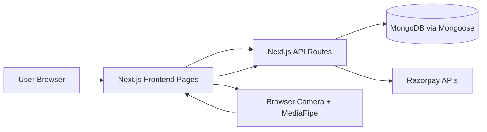
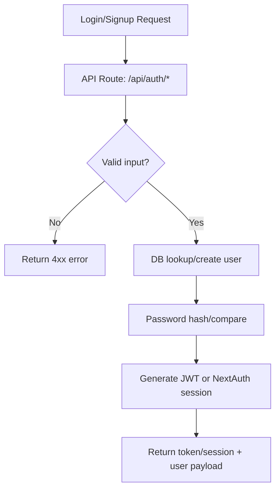

# HirePerfect Project Documentation

This document explains the project as a complete system:
- frontend vs backend responsibilities,
- architecture and runtime workflow,
- logic/function flowcharts,
- installation and run guide,
- project structure.

## 1) Project Overview

HirePerfect is a full-stack assessment platform built with Next.js App Router.
It provides:
- candidate assessment flow,
- admin management features,
- payment-based access control,
- AI-assisted proctoring during exams.

The project is implemented as a **single Next.js application**:
- frontend pages/components and backend API routes are in the same repo and runtime.
- there is no separate always-on backend server process.

## 2) Tech Stack

### Frontend
- Next.js 16 (App Router)
- React 19
- TypeScript
- Tailwind CSS

### Backend (inside Next.js API routes)
- Next.js Route Handlers (`app/api/**/route.ts`)
- MongoDB + Mongoose models
- JWT auth + NextAuth OAuth
- Razorpay integration

### AI/Proctoring
- MediaPipe Tasks Vision (`@mediapipe/tasks-vision`)
- Browser camera/media APIs

## 3) Frontend vs Backend

## Frontend Part

Primary folders:
- `app/` (pages, layouts, candidate/admin UI screens)
- `components/` (shared and feature UI components)
- `app/exam/pre/[id]/page.tsx` (pre-assessment camera readiness)
- `app/exam/[attemptId]/page.tsx` (live exam + proctoring UI + client-side proctoring logic)

Frontend responsibilities:
- render candidate/admin interfaces,
- handle local session state and interaction,
- call backend APIs for auth, attempts, payments, admin actions,
- run client-side proctoring loop during assessment.

## Backend Part

Primary folders:
- `app/api/` (all backend endpoints)
- `Backend/models/` (Mongoose schemas)
- `Backend/lib/` (auth/db/constants/payment helpers)
- `middleware/auth.ts` (JWT/NextAuth authorization middleware)

Backend responsibilities:
- authentication and authorization,
- CRUD operations for users/categories/assessments/questions,
- attempt lifecycle (start/load/submit),
- violation logging and termination thresholds,
- payment order creation and verification,
- stats and admin reporting.

## 4) Architecture Workflow

## High-Level Architecture



## Runtime Workflow

1. User interacts with UI pages (`app/**/page.tsx`).
2. Frontend calls route handlers (`app/api/**`).
3. API handlers validate auth via middleware.
4. API handlers read/write Mongoose models.
5. During exam, browser runs MediaPipe-based detection loop.
6. Frontend sends violations to backend logging endpoint.
7. Backend updates attempt status and may terminate session.

## 5) Core Logic Flowcharts

## A) Authentication Flow



## B) Assessment Lifecycle Flow

```mermaid
flowchart TD
    A[Candidate opens assessment] --> B[/api/assessments/:id/start]
    B --> C[Auth + access checks]
    C --> D[Create/Resume Attempt]
    D --> E[Randomize and return questions]
    E --> F[Exam page loads /api/attempts/:id]
    F --> G[Candidate answers]
    G --> H[/api/assessments/:id/submit]
    H --> I[Score + percentage + save attempt]
    I --> J[Results page]
```

## C) Proctoring Flow

```mermaid
flowchart TD
    A[Exam starts] --> B[Init camera stream]
    B --> C[Load FaceLandmarker]
    C --> D[Detection loop]
    D --> E{Rule violation?}
    E -- No --> D
    E -- Yes --> F[Client warning + local count]
    F --> G[/api/violations/log]
    G --> H[Persist violation + increment attempt count]
    H --> I{Threshold reached?}
    I -- No --> D
    I -- Yes --> J[Attempt terminated]
```

## D) Payment Access Flow

```mermaid
flowchart TD
    A[Candidate chooses purchase] --> B[/api/payment/create-order]
    B --> C[Create pending purchase + transaction]
    C --> D[Razorpay checkout]
    D --> E[/api/payment/verify]
    E --> F[Verify signature]
    F --> G[Mark transaction captured]
    G --> H[Mark purchase completed]
    H --> I[Assessment access unlocked]
```

## E) Admin Management Flow

```mermaid
flowchart TD
    A[Admin page action] --> B[/api/admin/*]
    B --> C[adminMiddleware role check]
    C --> D[DB read/write]
    D --> E[Return updated state]
```

## 6) Important Functional Areas

## Candidate Side
- Authentication (`/login`, `/signup`)
- Assessment catalog (`/assessments`)
- Attempt taking (`/exam/pre/[id]`, `/exam/[attemptId]`)
- Result review (`/results/[attemptId]`)
- Dashboard (`/dashboard`)

## Admin Side
- Users management
- Categories/assessments/questions CRUD
- Attempts and logs monitoring
- Aggregated stats

## Shared Security
- Auth middleware (`authMiddleware`, `adminMiddleware`)
- JWT and NextAuth dual support
- Fullscreen/tab-switch/resize controls during exams

## 7) Installation Guide

## Prerequisites
- Node.js 18+
- npm
- MongoDB local instance or MongoDB Atlas URI
- Razorpay credentials (if testing payments)
- OAuth credentials (if testing Google/GitHub login)

## Step-by-Step Setup

1. Clone repository
```bash
git clone <your-repo-url>
cd hireperfect
```

2. Install dependencies
```bash
npm install
```

3. Configure environment
```bash
cp .env.example .env.local
```

Set required values in `.env.local`:
- `MONGODB_URI`
- `JWT_SECRET`
- `NEXT_PUBLIC_APP_URL`

Optional but recommended for full features:
- `RAZORPAY_KEY_ID`, `RAZORPAY_KEY_SECRET`
- `GOOGLE_CLIENT_ID`, `GOOGLE_CLIENT_SECRET`
- `GITHUB_CLIENT_ID`, `GITHUB_CLIENT_SECRET`
- `NEXTAUTH_SECRET`
- `ADMIN_SIGNUP_SECRET`

4. Seed database
```bash
npm run seed
```

5. Start application (frontend + backend in one process)
```bash
npm run dev
```

6. Open in browser
- `http://localhost:3000`

## Production Run
```bash
npm run build
npm run start
```

## Note on "Backend Server"
- This project does not require a separate backend server command.
- Backend APIs are served by Next.js route handlers inside the same app process.

## 8) Useful Commands

```bash
# Development
npm run dev

# Lint
npm run lint

# Build
npm run build

# Start production build
npm run start

# Seed data
npm run seed
```

## 9) Environment and Configuration Notes

- `tsconfig.json` path aliases map `@/lib/*` to both `lib/*` and `Backend/lib/*`.
- `connectDB()` pre-registers models to reduce populate schema errors.
- Some API paths include testing-oriented behavior (for access/scoring) and should be reviewed before strict production use.

## 10) Deployment Notes

- Deploy as a standard Next.js app (e.g., Vercel or Node host).
- Ensure production environment variables are configured.
- Ensure MongoDB network/IP and credentials are correctly set.
- Configure OAuth callback URLs for deployed domain.

## 11) Project Structure (End)

```text
hireperfect/
├── app/
│   ├── api/                          # Backend route handlers
│   │   ├── auth/
│   │   ├── assessments/
│   │   ├── attempts/
│   │   ├── violations/
│   │   ├── payment/
│   │   ├── admin/
│   │   ├── debug/
│   │   └── maintenance/
│   ├── exam/
│   │   ├── pre/[id]/page.tsx         # Pre-assessment camera checks
│   │   └── [attemptId]/page.tsx      # Live exam + AI proctoring
│   ├── admin/                        # Admin UI pages
│   ├── dashboard/                    # Candidate dashboard
│   ├── assessments/                  # Candidate assessment catalog
│   ├── results/[attemptId]/page.tsx  # Result page
│   ├── login/ signup/                # Auth pages
│   ├── layout.tsx
│   └── page.tsx
├── components/
│   ├── CameraSentinel.tsx
│   └── ui/
├── Backend/
│   ├── lib/                          # Shared backend utilities
│   ├── models/                       # Mongoose schemas
│   ├── prisma/                       # Prisma schema/client support
│   └── scripts/                      # Seed and diagnostics scripts
├── lib/
│   └── cameraManager.ts
├── middleware/
│   └── auth.ts
├── package.json
├── tsconfig.json
└── README.md
```
